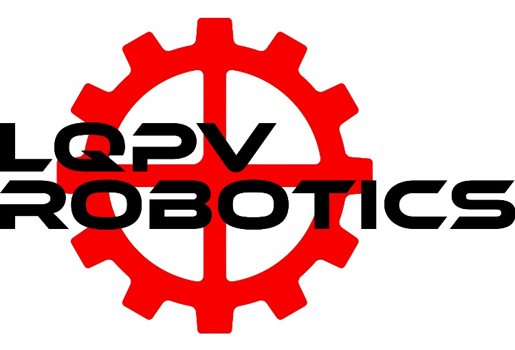
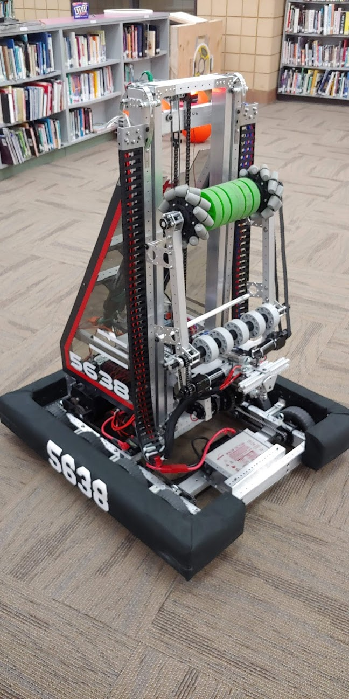

# FRC 2019

Welcome to LqPV Robotics' 2019 Robot Code! Here you will find all of our subsystems and commands which run our robot.
 

## Branches
- DeepSpace Branch is working code.
- DeepSpaceTest Branch is for code to be tested.

## Features
- Motion Magic control on Elevator and Wrist subsystems.
- Drive motor voltage ramping proportional to elevator height.
- Multiple Elevator setpoints.
- Custom vision PID loop using a Limelight.
- Dual camera streams to ShuffleBoard (Limelight and Microsoft Lifecam HD3000).
- Elevator and Wrist encoder checking on boot.
- Teleop during Autonomous

## DriveTrain

This subsystem is where all of code that is associated with the drive base lives.

getElevatorHeight() allows us to use the current height of the elevator to ramp the drive motors. This helps keep the robot from accelerating too quickly while the elevator is raised. If the drive base were to accelerate too quickly, the robot would drive out from under itself causing it to tip.

Our vision method is also located here. It is called whenever the driver presses button 1 on their controller. The vision method allows the robot to turn on its own. Due to the ability for the drive team to operate the robot during autonomous mode this year, we decided to allow the driver to control the throttle inputs.

The drivetrain we are using this year utilizes a two speed gearbox which means it has the ability to shift between high and low gears. Currently we have the driver shift into low gear as long as button 4 is held, and high gear while button 4 is released. We plan on adding automatic shifting in the future as most of the code is already there for it and we just have to fine tune it.

## Elevator

Our elevator subsystem is what controls the verticle motion of our hatch and cargo mechanisms.

The elevatorPosition method is where we are able to set the position of our elevator. This is done at a press of a button. The elevator utilizes Motion Magic to provide smooth and controllable transitions between setpoints. We have six different setpoints for our elevator. Each setpoint for all three levels of hatches and cargo, as well as level 1 cargo being the zero position on the elevator.

## Intake

This subsystem controls our cargo intake wheels.

## Wrist

The wrist subsystem controls the wrist on our robot. Our wrist is contains both our cargo intake and our hatch mechanism.

The wristPosition method is where we are able to set the position of our wrist. This is done at a press of a button. The wrist utilizes Motion Magic to provide smooth and controllable transitions between setpoints. There are currently two setpoints for the wrist: Cargo intake mode, and zero. We plan to add a third at competition for the Cargoship.

## TalonChecker

This class checks if the encoder is nominal on boot of the RoboRio.

## RobotMap

Where we instantiate all of our solenoids and motors. We also set our PIDF values here for Motion Magic.

## Robot

We control our LEDs through the Robot class so they are able to match the mode and alliance the robot is currently in. We also transition straight to teleop mode whenever the autonomousInit() or autonomousPeriodic() methods are called.

## OI

The OI, also called Operator Interface, is where we keep all of our buttons for commands. Each button for the elevator or wrist is also assigned the setpoint for the elevator or wrist. This allows us to keep the Commands folder and the amount of methods in our Elevator and Wrist classes clean.
